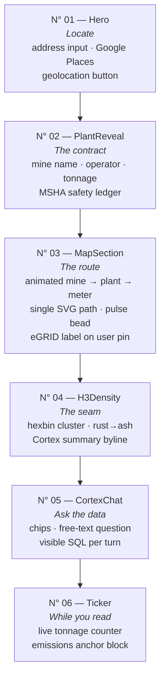
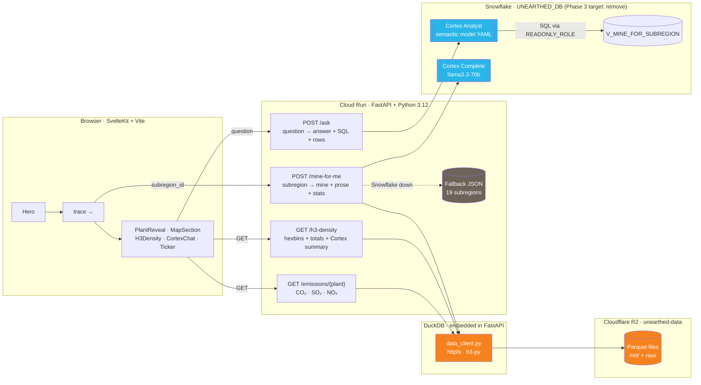

# Unearthed

**Find the coal mine under contract to your local power plant. Watch it die in real time. Ask it questions.**

Unearthed turns public federal data (MSHA + EIA + EPA) into a consumer-scale reveal: enter an address, see the specific coal mine feeding your grid, read memorial prose written from that mine's safety record, then ask natural-language questions about the contract.

- **Claude Sonnet** (via Anthropic) drives natural-language Q&A (tool-using agent over DuckDB) — *migration in progress, currently Cortex Analyst*
- **DuckDB + Cloudflare R2** serve all data endpoints — Parquet files over httpfs, no warehouse, no daemon
- **H3 hexbin geospatial** computed at query time via `h3-py`
- **Cortex Analyst** (Snowflake) currently powers `/ask`; will be replaced by the Claude agent in Phase 3

> **New to the codebase?** Skim the [repo map](#repo-map) and [architecture](#system-architecture), then read [`AGENTS.md`](./AGENTS.md) before touching anything.

---

## User Journey

Scroll-driven dark editorial layout. Each numbered section owns one beat.



Every section is wrapped in `SectionRail.svelte` (vertical left-gutter N° / rule / rotated label).

---

## System Architecture

Three tiers: SvelteKit in the browser, FastAPI on Cloud Run, data served from DuckDB over Cloudflare R2. `/ask` still calls Snowflake Cortex Analyst pending Phase 3.



**Security boundary on `/ask`:** Cortex-Analyst-generated SQL is validated (SELECT-only, single-statement) and executed through `UNEARTHED_READONLY_ROLE`, capped at `STATEMENT_TIMEOUT_IN_SECONDS=10` and `ROWS_PER_RESULTSET=500`.

See [`system-diagram.md`](./system-diagram.md) for the full runtime, data-load, and security flows.

---

## Repo Map

```
unearthed/
├── app/
│   ├── main.py              — FastAPI endpoints, middleware, caches
│   ├── data_client.py       — DuckDB read-only boundary (R2 via httpfs)
│   ├── snowflake_client.py  — Snowflake key-pair auth, pool, role scoping (Phase 5: delete)
│   ├── prose_client.py      — Cortex Complete prose + H3 summary (Phase 5: delete)
│   ├── models.py            — Pydantic I/O schemas
│   └── config.py            — env + secrets
│
├── frontend/
│   ├── src/lib/sections/    — Hero · PlantReveal · MapSection · H3Density · CortexChat · Ticker
│   ├── src/lib/components/  — SectionRail
│   ├── src/lib/             — api.js · geo.js · maps.js · reveal.js
│   └── e2e/                 — Playwright specs + fixtures.js
│
├── tests/
│   ├── unit/                — pure function coverage (data_client, prose fallback, SQL validation)
│   ├── integration/         — TestClient + mocked data layer
│   ├── performance/         — request-budget guards
│   └── fixtures/            — build_parquet.py (generates fixture Parquet for unit tests)
│
├── scripts/
│   ├── export_snowflake_to_parquet.py  — one-time Snowflake → Parquet export
│   └── upload_to_r2.py                — idempotent Parquet → R2 upload
│
├── assets/
│   ├── fallback/            — 19 per-subregion fallback JSONs
│   └── semantic_model.yaml  — Cortex Analyst semantic model
│
├── static/                  — public frontend assets (favicon, hero image)
├── AGENTS.md                — coding rules + conventions (read before contributing)
├── MIGRATION.md             — Snowflake → R2 + DuckDB + Claude phased brief
├── system-diagram.md        — runtime + data-load + security flow diagrams
└── PRD.md                   — product spec
```

---

## Tech Stack

| Layer | Stack |
|---|---|
| Frontend | SvelteKit 2 + Svelte 5 runes · Vite · Google Maps JS API (dynamic `importLibrary`) · Google Places API (New) |
| Backend | Python 3.12 · FastAPI · `uv` · DuckDB (`httpfs` + `h3-py`) |
| Data storage | Cloudflare R2 · Parquet (mrt/ + raw/ layout) |
| AI (current) | Snowflake Cortex Analyst (NL→SQL for `/ask`) · Cortex Complete (`llama3.3-70b`) for prose |
| AI (target) | Claude Sonnet 4.6 + tool-use agent (Phase 3) |
| Deploy | Google Cloud Run · Secret Manager · Docker |
| Testing | `pytest` (unit / integration / perf) · Vitest + `@testing-library/svelte` · Playwright · Lighthouse CI |
| Lint / format | `ruff` (Python) · ESLint + Prettier (JS/Svelte) |

---

## Quickstart

```sh
make install          # backend (uv) + frontend (pnpm)
cp .env.example .env  # fill in credentials (see below)
make dev              # backend on :8001 + frontend on :5173 (Vite proxies /api → :8001)
```

Need just one side? `make dev-backend` and `make dev-frontend` run them individually.

Open http://localhost:5173.

### Environment variables

`.env.example` documents every variable. Minimum required:

**DuckDB / Cloudflare R2 (data endpoints):**

| Variable | Purpose |
|---|---|
| `DATA_BASE_URL` | `s3://unearthed-data` in production; local path for dev/test |
| `R2_ACCESS_KEY_ID` | R2 API token key ID (Object Read scope) |
| `R2_SECRET_ACCESS_KEY` | R2 API token secret |
| `R2_ENDPOINT` | `https://<account_id>.r2.cloudflarestorage.com` |

**Snowflake (still required for `/ask` + prose until Phase 3):**

| Variable | Purpose |
|---|---|
| `SNOWFLAKE_ACCOUNT` | Account identifier |
| `SNOWFLAKE_USER` | Username |
| `SNOWFLAKE_PRIVATE_KEY_PATH` | Path to RSA private key (`.p8`) |
| `SNOWFLAKE_WAREHOUSE` | `UNEARTHED_APP_WH` |
| `SNOWFLAKE_DATABASE` | `UNEARTHED_DB` |
| `SNOWFLAKE_ROLE` | `UNEARTHED_APP_ROLE` |
| `SNOWFLAKE_READONLY_ROLE` | `UNEARTHED_READONLY_ROLE` |

**Google Maps (frontend):**

| Variable | Purpose |
|---|---|
| `VITE_GOOGLE_MAPS_KEY` | Restrict to your dev origin + production domain; enable Maps JS + Places API (New) |

---

## Testing

```sh
make test-ci          # pytest (no e2e marker) + vitest + playwright — CI safe
make test             # everything, including backend e2e + Lighthouse CI
make test-cov         # pytest with coverage report
make lint             # ruff check + eslint
```

| Suite | Tool | Scope |
|---|---|---|
| `tests/unit/` | pytest | `data_client` queries against fixture Parquet, SQL validation, prose fallback, suggestions |
| `tests/integration/` | pytest + FastAPI TestClient | All endpoints with mocked data layer — happy path, edge cases, CORS, 405s, degraded mode |
| `tests/performance/` | pytest | Response-size and latency budget guards |
| `frontend/src/**/*.test.js` | Vitest + jsdom | Components + helpers — PlantReveal, CortexChat, Ticker, SectionRail, api.js, geo.js, reveal.js |
| `frontend/e2e/` | Playwright | Share-URL replay, pushState history, editorial rail integrity, error states, Google Maps runtime via behavioral stub |
| `frontend/lighthouserc.cjs` | `@lhci/cli` | a11y=1.0 · SEO=1.0 · Best Practices≥0.98 · Performance≥0.90 |

---

## Where Things Live

- **Product spec + success criteria:** [`PRD.md`](./PRD.md)
- **All coding rules, naming conventions, architecture constraints:** [`AGENTS.md`](./AGENTS.md) — read before writing code
- **Migration phased brief (Snowflake → R2 + DuckDB + Claude):** [`MIGRATION.md`](./MIGRATION.md)
- **Runtime / data-load / security flow diagrams:** [`system-diagram.md`](./system-diagram.md)

---

## License

Polyform Shield 1.0.0 — see [`LICENSE`](./LICENSE).

Built with [Claude](https://anthropic.com) · [DuckDB](https://duckdb.org) · [Cloudflare R2](https://developers.cloudflare.com/r2/)
