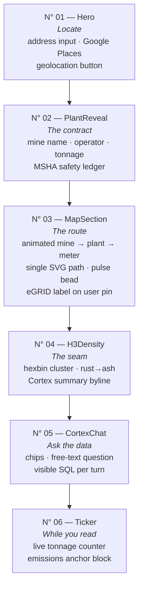
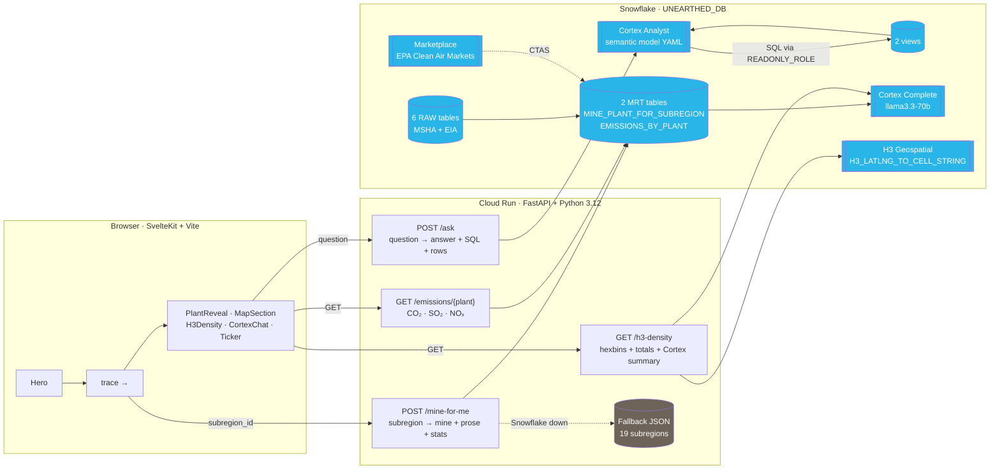
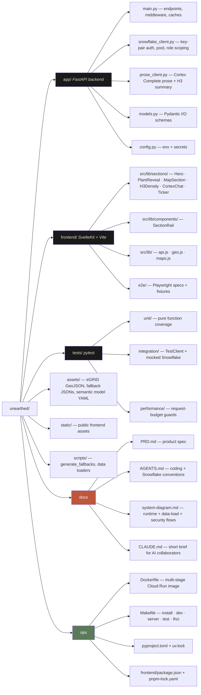

# Unearthed

**Tagline:** Find the coal mine under contract to your local power plant. Watch it die in real time. Ask it questions.

Unearthed turns public federal data (MSHA + EIA + EPA) into a consumer-scale reveal: enter an address, see the specific coal mine feeding your grid, read memorial prose written from that mine's safety record, then ask natural-language questions about the contract. Built for the **DEV Weekend Challenge 2026 — Earth Day Edition**, targeting the **Snowflake Cortex** sponsor category.

- **Cortex Analyst** drives natural-language Q&A (semantic model → SQL → real rows).
- **Cortex Complete** (`llama3.3-70b`) writes the mine-memorial prose and the 2–3 sentence summary under the national density map — both carry a degraded flag so template fallbacks never sit under a Cortex byline.
- **H3 hexbin geospatial** + **Marketplace** (EPA Clean Air Markets) are used natively inside Snowflake — no extraction, no ETL away.

> **For challenge judges:** the fastest tour is the [user journey diagram](#user-journey) (what the site does), the [system diagram](#system-architecture) (how Cortex is used), and [`PRD.md`](./PRD.md) §1–3 (why it exists).
>
> **For new devs:** skim the [repo map](#repo-map), then [`AGENTS.md`](./AGENTS.md) for coding rules and Snowflake conventions before touching anything.

---

## User Journey

Scroll-driven dark editorial layout. Each numbered section owns one beat.



Every section is wrapped in `SectionRail.svelte` (vertical left-gutter N° / rule / rotated label), so the page reads as one magazine spread.

---

## System Architecture

Three tiers: SvelteKit in the browser, FastAPI on Cloud Run, Snowflake as the data + AI spine. Snowflake does the work Snowflake is best at — warehouse, Cortex, H3 geospatial, Marketplace — and the backend is thin.



**Security boundary on `/ask`:** every Cortex-Analyst-generated SQL is validated (SELECT-only, single-statement) and executed through the least-privilege `UNEARTHED_READONLY_ROLE`, capped at `STATEMENT_TIMEOUT_IN_SECONDS=10`, `ROWS_PER_RESULTSET=500`, and a hard `fetchmany(500)`. See [`system-diagram.md`](./system-diagram.md) for the full security flow.

---

## Repo Map



---

## Tech Stack

| Layer | Stack |
|---|---|
| Frontend | SvelteKit 2 + Svelte 5 runes · Vite · Google Maps JS API (dynamic `importLibrary`) · Google Places API (New) |
| Backend | Python 3.12 · FastAPI · `uv` · key-pair Snowflake auth · thread-local connection pool |
| Data + AI | Snowflake Cortex Analyst (NL→SQL) · Cortex Complete (`llama3.3-70b`) · H3 geospatial · Marketplace (EPA CAM) |
| Deploy | Google Cloud Run · Secret Manager · multi-stage Docker |
| Testing | `pytest` (unit / integration / perf) · `vitest` + `@testing-library/svelte` · Playwright · Lighthouse CI (a11y=1.0, SEO=1.0, BP≥0.98, perf≥0.90) |
| Lint/Format | `ruff` (line-length 100) · `pnpm lint` |

---

## Quickstart

```sh
make install          # backend (uv) + frontend (pnpm)
cp .env.example .env  # fill in Snowflake + Google Maps keys
make server           # backend on :8001
make dev              # frontend on :5173 (proxies /api to backend)
```

Then open http://localhost:5173.

### Required environment

`.env.example` documents every variable. At minimum:

- **Snowflake (backend):** `SNOWFLAKE_ACCOUNT`, `SNOWFLAKE_USER`, `SNOWFLAKE_PRIVATE_KEY_PATH`, `SNOWFLAKE_WAREHOUSE`, `SNOWFLAKE_DATABASE`, `SNOWFLAKE_ROLE` (`UNEARTHED_APP_ROLE`), `SNOWFLAKE_READONLY_ROLE` (`UNEARTHED_READONLY_ROLE`).
- **Google Maps (frontend):** `VITE_GOOGLE_MAPS_KEY` — restrict to `http://localhost:5173` + your production origin, enable Maps JS + Places API (New).

Snowflake schema provisioning (roles, tables, MRT builds, Marketplace subscription) is covered in [`AGENTS.md`](./AGENTS.md) §3.

---

## Testing

```sh
make test-ci          # pytest (no e2e marker) + vitest + playwright — CI safe
make test             # everything, including backend e2e + Lighthouse CI
make test-cov         # pytest with coverage report
make lint             # ruff check + format --check
```

The test matrix:

| Suite | Tool | What it covers |
|---|---|---|
| `tests/unit/` | pytest | Pure functions — SQL validation, prose fallback, stats extraction, suggestions, model validation |
| `tests/integration/` | pytest + FastAPI TestClient | Endpoints with mocked Snowflake — happy path, edge cases, CORS, 405s, degraded paths |
| `tests/performance/` | pytest | Request-budget guards (response size, lookup time) |
| `frontend/src/**/*.test.js` | vitest + jsdom | Components + helpers in isolation — PlantReveal (+ emissions), CortexChat, Ticker, SectionRail, api client (+ edge), geo helpers (+ edge), reveal state machine |
| `frontend/e2e/` | Playwright | Share-URL replay, pushState history, editorial rail integrity, error-state rendering, Google Maps runtime (MapSection + H3Density) against a behavioral `google.maps` stub |
| `frontend/lighthouserc.cjs` | `@lhci/cli` | a11y=1.0, SEO=1.0, best-practices≥0.98, perf≥0.90 |

---

## Where Things Live

- **Product spec + success criteria:** [`PRD.md`](./PRD.md)
- **Coding rules, Snowflake standards, naming conventions:** [`AGENTS.md`](./AGENTS.md) — read before writing code.
- **Runtime / data-load / security flow diagrams:** [`system-diagram.md`](./system-diagram.md)
- **Short brief for AI pair programmers:** [`CLAUDE.md`](./CLAUDE.md)

---

## License

Polyform Shield 1.0.0 — see [`LICENSE`](./LICENSE).

Built with care and with the help of Claude (Anthropic) for the DEV Weekend Challenge 2026 — Earth Day Edition.
