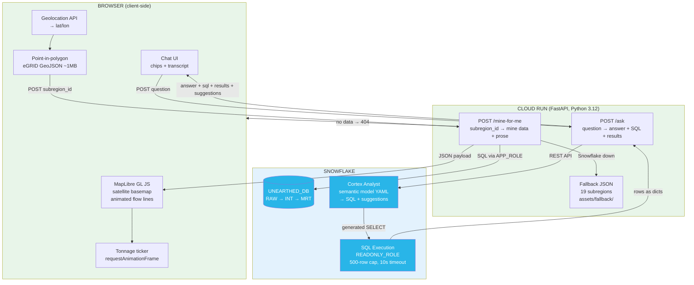
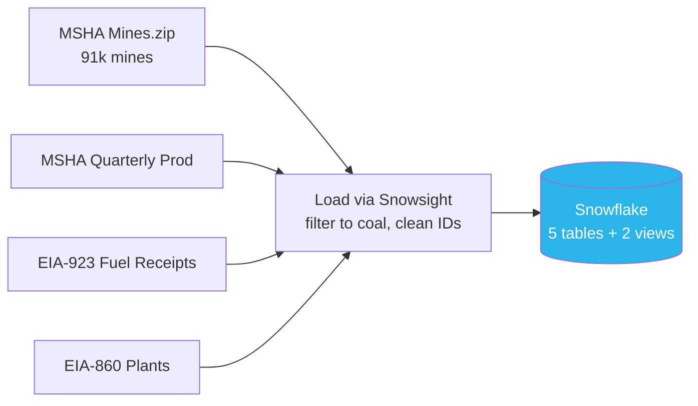
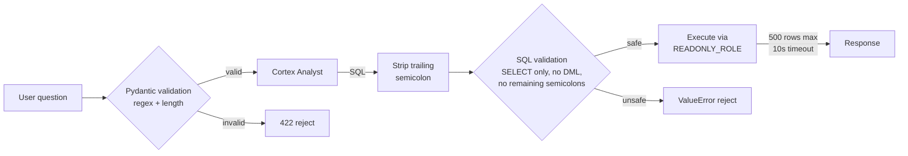

# System Architecture

## Runtime Flow

```mermaid
flowchart TB
    subgraph BROWSER["BROWSER (client-side)"]
        GEO[Geolocation API<br/>→ lat/lon]
        PIP[Point-in-polygon<br/>eGRID GeoJSON ~1MB]
        MAP[MapLibre GL JS<br/>satellite basemap<br/>animated flow lines]
        TICKER[Tonnage ticker<br/>requestAnimationFrame]
        CHAT[Chat UI<br/>chips + transcript]
        GEO --> PIP
    end

    subgraph API["CLOUD RUN (FastAPI, Python 3.12)"]
        MINE_EP[POST /mine-for-me<br/>subregion_id → mine data + prose]
        ASK_EP[POST /ask<br/>question → answer + SQL + results]
        FALLBACK[Fallback JSON<br/>19 subregions<br/>assets/fallback/]
    end

    subgraph SNOW["SNOWFLAKE"]
        DB[(UNEARTHED_DB<br/>RAW → INT → MRT)]
        CORTEX[Cortex Analyst<br/>semantic model YAML<br/>→ SQL + suggestions]
        RO_EXEC[SQL Execution<br/>READONLY_ROLE<br/>500-row cap, 10s timeout]
    end

    PIP -->|POST subregion_id| MINE_EP
    CHAT -->|POST question| ASK_EP
    MINE_EP -->|SQL via APP_ROLE| DB
    MINE_EP -->|Snowflake down| FALLBACK
    MINE_EP -->|JSON payload| MAP
    MAP --> TICKER
    ASK_EP -->|REST API| CORTEX
    CORTEX -->|generated SELECT| RO_EXEC
    RO_EXEC -->|rows as dicts| ASK_EP
    ASK_EP -->|answer + sql + results + suggestions| CHAT
    MINE_EP -->|no data → 404| BROWSER

    style DB fill:#29b5e8,color:#fff
    style CORTEX fill:#29b5e8,color:#fff
    style RO_EXEC fill:#29b5e8,color:#fff
    style BROWSER fill:#e8f5e9
    style API fill:#e8f5e9
    style SNOW fill:#e3f2fd
```

## Data Loading (one-time)

```mermaid
flowchart LR
    MSHA1[MSHA Mines.zip<br/>91k mines] --> LOAD
    MSHA2[MSHA Quarterly Prod] --> LOAD
    EIA1[EIA-923 Fuel Receipts] --> LOAD
    EIA2[EIA-860 Plants] --> LOAD
    LOAD[Load via Snowsight<br/>filter to coal, clean IDs] --> DB[(Snowflake<br/>5 tables + 2 views)]
    style DB fill:#29b5e8,color:#fff
```

## Security Layers

```mermaid
flowchart LR
    Q[User question] --> V{Pydantic validation<br/>regex + length}
    V -->|valid| CA[Cortex Analyst]
    V -->|invalid| R422[422 reject]
    CA -->|SQL| STRIP[Strip trailing<br/>semicolon]
    STRIP --> CHK{SQL validation<br/>SELECT only, no DML,<br/>no remaining semicolons}
    CHK -->|safe| EXEC[Execute via<br/>READONLY_ROLE]
    CHK -->|unsafe| RVAL[ValueError reject]
    EXEC -->|500 rows max<br/>10s timeout| RESP[Response]
```
