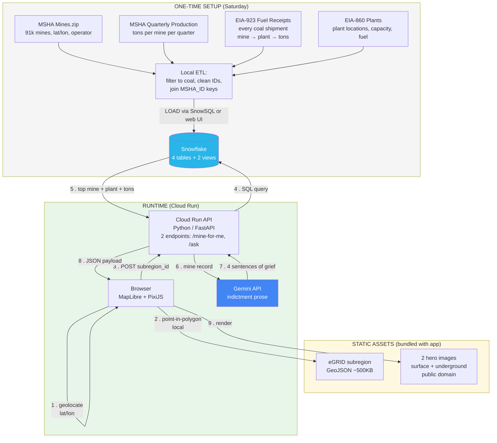

```mermaid
flowchart TB
    subgraph STAGE["ONE-TIME SETUP (Saturday)"]
        direction LR
        MSHA1[MSHA Mines.zip<br/>91k mines, lat/lon, operator]
        MSHA2[MSHA Quarterly Production<br/>tons per mine per quarter]
        EIA1[EIA-923 Fuel Receipts<br/>every coal shipment<br/>mine → plant → tons]
        EIA2[EIA-860 Plants<br/>plant locations, capacity, fuel]
        PREP[Local ETL:<br/>filter to coal, clean IDs,<br/>join MSHA_ID keys]
        SNOW[(Snowflake<br/>4 tables + 2 views)]

        MSHA1 --> PREP
        MSHA2 --> PREP
        EIA1 --> PREP
        EIA2 --> PREP
        PREP -->|LOAD via SnowSQL or web UI| SNOW
    end

    subgraph STATIC["STATIC ASSETS (bundled with app)"]
        GEO[eGRID subregion<br/>GeoJSON ~500KB]
        IMG[2 hero images<br/>surface + underground<br/>public domain]
    end

    subgraph APP["RUNTIME (Cloud Run)"]
        direction LR
        BROWSER[Browser<br/>MapLibre + PixiJS]
        API[Cloud Run API<br/>Python / FastAPI<br/>2 endpoints: /mine-for-me, /ask]
        GEMINI[Gemini API<br/>indictment prose]
    end

    BROWSER -->|1 . geolocate<br/>lat/lon| BROWSER
    BROWSER -->|2 . point-in-polygon<br/>local| GEO
    BROWSER -->|3 . POST subregion_id| API
    API -->|4 . SQL query| SNOW
    SNOW -->|5 . top mine + plant + tons| API
    API -->|6 . mine record| GEMINI
    GEMINI -->|7 . 4 sentences of grief| API
    API -->|8 . JSON payload| BROWSER
    BROWSER -->|9 . render| IMG

    style SNOW fill:#29b5e8,color:#fff
    style GEMINI fill:#4285f4,color:#fff
    style STAGE fill:#f5f5f5
    style STATIC fill:#fff8e1
    style APP fill:#e8f5e9
```
