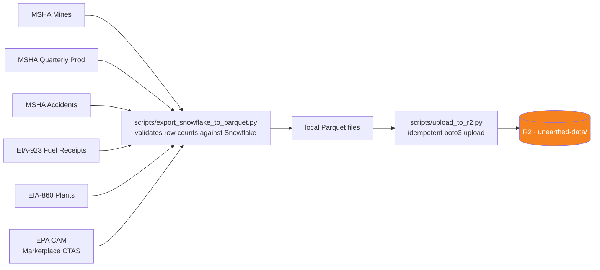
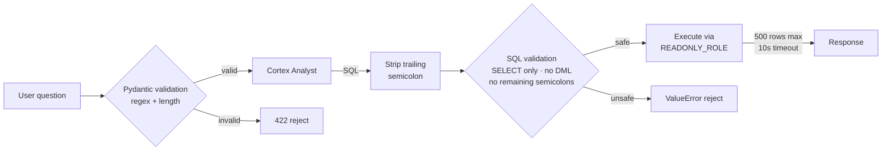
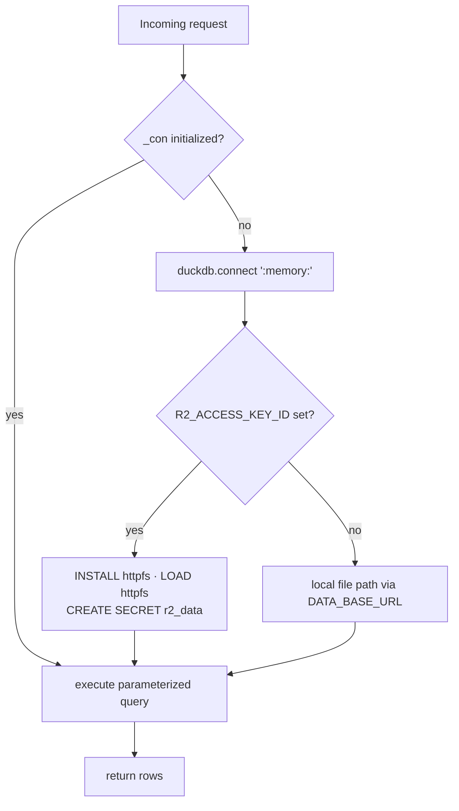

# System Architecture

## Runtime Flow

Three tiers. DuckDB/R2 handles all data reads; Snowflake Cortex handles `/ask` and prose until Phase 3.

```mermaid
flowchart TB
    subgraph BROWSER["BROWSER (SvelteKit)"]
        GEO[Geolocation / Places<br/>→ lat/lon → subregion_id]
        SCROLL[Scroll sections<br/>editorial data reveals]
        MAP[Google Maps JS API<br/>satellite · animated arc · eGRID overlay]
        H3UI[H3Density section<br/>hexbins + Cortex summary byline]
        CHAT[CortexChat<br/>chips · free-text · visible SQL]
        GEO --> SCROLL
    end

    subgraph API["CLOUD RUN (FastAPI, Python 3.12)"]
        MINE_EP[POST /mine-for-me<br/>→ mine + prose + stats]
        ASK_EP[POST /ask<br/>→ answer + SQL + rows]
        H3_EP[GET /h3-density<br/>→ hexbins + totals + summary]
        EMIT_EP[GET /emissions/{plant}<br/>→ CO₂ · SO₂ · NOₓ]
        DC[data_client.py<br/>DuckDB · httpfs · h3-py]
        FALLBACK[Fallback JSON<br/>19 subregions]
    end

    subgraph R2["CLOUDFLARE R2 · unearthed-data/"]
        MRT[(mrt/<br/>mine_plant_for_subregion.parquet<br/>emissions_by_plant.parquet<br/>v_mine_for_subregion.parquet)]
        RAW[(raw/<br/>msha_mines · msha_accidents<br/>eia_923 · eia_860 · lookup)]
    end

    subgraph SNOW["SNOWFLAKE (Phase 3 target: remove)"]
        CORTEX[Cortex Analyst<br/>semantic model YAML]
        COMPLETE[Cortex Complete<br/>llama3.3-70b prose]
        RO_EXEC[SQL Execution<br/>UNEARTHED_READONLY_ROLE]
    end

    SCROLL -->|POST subregion_id| MINE_EP
    CHAT -->|POST question| ASK_EP
    H3UI -->|GET| H3_EP
    SCROLL -->|GET /emissions/:plant| EMIT_EP

    MINE_EP --> DC
    H3_EP --> DC
    EMIT_EP --> DC
    DC --> MRT
    DC -.-> RAW

    MINE_EP -->|Snowflake down| FALLBACK
    MINE_EP -->|stats| COMPLETE
    COMPLETE -->|prose| MINE_EP

    ASK_EP -->|REST API| CORTEX
    CORTEX -->|SQL| RO_EXEC
    RO_EXEC -->|rows| ASK_EP

    style DC fill:#f6821f,color:#fff
    style MRT fill:#f6821f,color:#fff
    style RAW fill:#f6821f,color:#fff
    style CORTEX fill:#29b5e8,color:#fff
    style COMPLETE fill:#29b5e8,color:#fff
    style RO_EXEC fill:#29b5e8,color:#fff
    style FALLBACK fill:#6e6359,color:#fff
```

## Data Loading (one-time, repeat for refreshes)



## Security Layers



## DuckDB Connection Lifecycle


