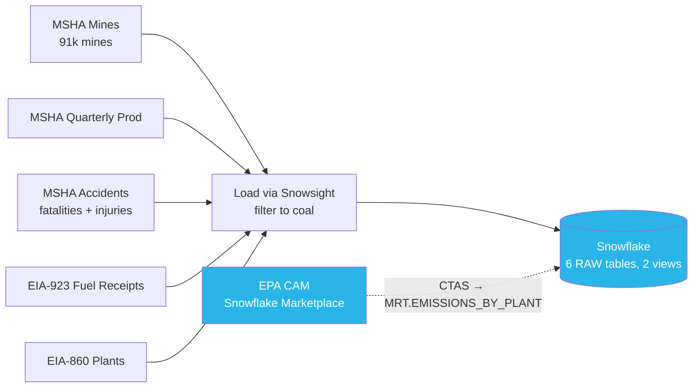
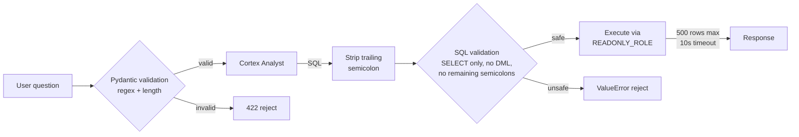

# System Architecture

## Runtime Flow

```mermaid
flowchart TB
    subgraph BROWSER["BROWSER (SvelteKit)"]
        GEO[Geolocation / Geocoding<br/>→ lat/lon → subregion]
        SCROLL[Scroll sections<br/>glassmorphism data reveals]
        MAP[MapLibre GL JS<br/>satellite + animated arc]
        CHAT[Cortex Analyst chat<br/>chips + expandable SQL]
        GEO --> SCROLL
    end

    subgraph API["CLOUD RUN (FastAPI, Python 3.12)"]
        MINE_EP[POST /mine-for-me<br/>→ mine data + prose]
        ASK_EP[POST /ask<br/>→ answer + SQL + results]
        H3_EP[GET /h3-density<br/>→ H3 hexbin scar grid]
        EMIT_EP[GET /emissions/{plant}<br/>→ CO2/SO2/NOx from EPA]
        FALLBACK[Fallback JSON<br/>19 subregions]
    end

    subgraph SNOW["SNOWFLAKE"]
        DB[(UNEARTHED_DB<br/>6 tables, 1 MRT table, 2 views)]
        ACCIDENTS[(MSHA_ACCIDENTS<br/>fatalities + injuries)]
        CORTEX[Cortex Analyst<br/>semantic model YAML]
        COMPLETE[Cortex Complete<br/>openai-gpt-5-chat prose]
        H3[H3 Geospatial<br/>hexbin density]
        RO_EXEC[SQL Execution<br/>READONLY_ROLE]
    end

    subgraph MKT["SNOWFLAKE MARKETPLACE (free, source for MRT)"]
        EPA[EPA Clean Air Markets<br/>CO2/SO2/NOx source data]
    end

    SCROLL -->|POST subregion_id| MINE_EP
    CHAT -->|POST question| ASK_EP
    MAP -->|GET| H3_EP
    SCROLL -->|GET| EMIT_EP
    MINE_EP -->|query| DB
    MINE_EP -->|fatality stats| ACCIDENTS
    MINE_EP -->|Snowflake down| FALLBACK
    ACCIDENTS -->|numbers| COMPLETE
    COMPLETE -->|prose| MINE_EP
    MINE_EP -->|JSON| SCROLL
    ASK_EP -->|REST API| CORTEX
    CORTEX -->|SELECT| RO_EXEC
    RO_EXEC -->|rows| ASK_EP
    ASK_EP -->|answer + SQL| CHAT
    H3_EP -->|H3_LATLNG_TO_CELL| H3
    EMIT_EP -->|SELECT| DB

    style DB fill:#29b5e8,color:#fff
    style ACCIDENTS fill:#29b5e8,color:#fff
    style CORTEX fill:#29b5e8,color:#fff
    style COMPLETE fill:#29b5e8,color:#fff
    style H3 fill:#29b5e8,color:#fff
    style RO_EXEC fill:#29b5e8,color:#fff
    style EPA fill:#29b5e8,color:#fff
    style BROWSER fill:#1a1a1a,color:#e8e0d4
    style API fill:#1a1a1a,color:#e8e0d4
    style SNOW fill:#e3f2fd
    style MKT fill:#e3f2fd
```

## Data Loading (one-time)



## Security Layers


